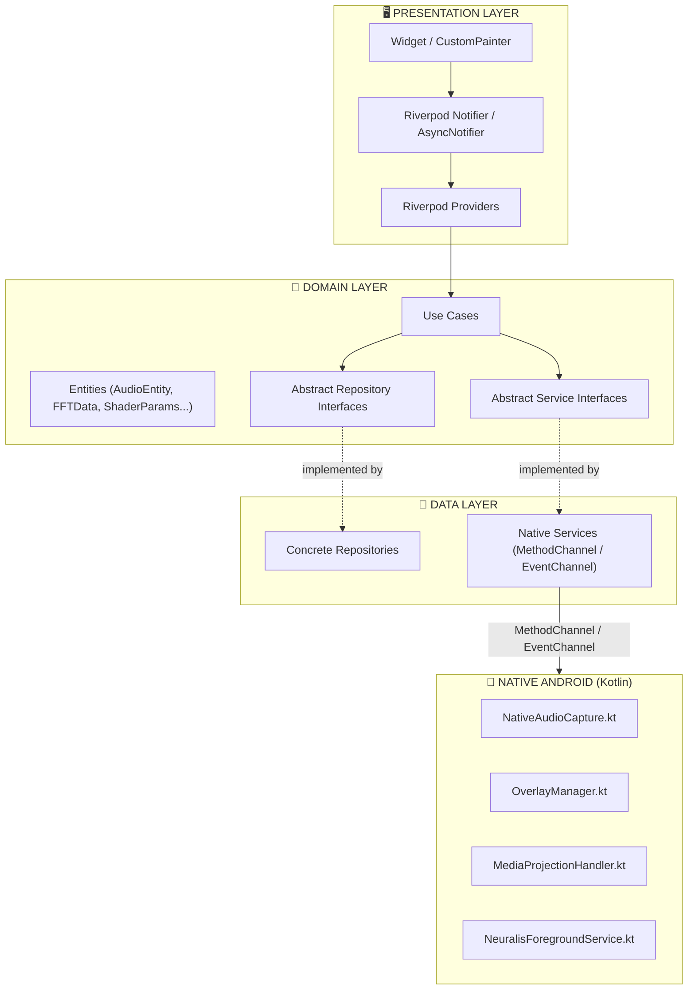
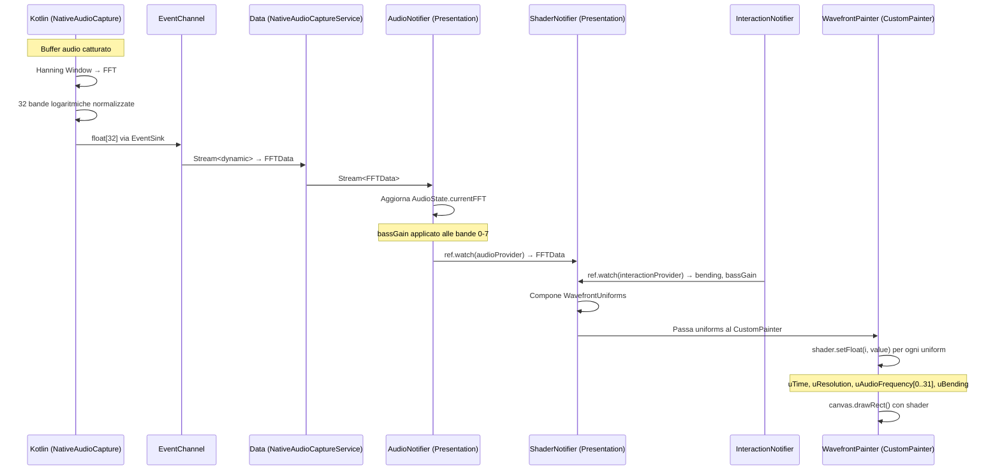

# 🏛 NEURALIS — Documento di Architettura

### Neural LCARS Overlay System — Enterprise Edition V.1.2

---

## 1. Decisioni Architetturali Vincolanti

| Categoria | Scelta | Motivazione |
|---|---|---|
| State Management | Riverpod 3.x (`Notifier` / `AsyncNotifier`) | API moderna, DI integrata, testabilità |
| Dependency Injection | Riverpod Providers | Nessun container esterno |
| Code Generation | `riverpod_generator` + `build_runner` | Riduzione boilerplate, type-safety |
| Audio Capture | `MethodChannel` + `EventChannel` custom (Kotlin) | Controllo totale, zero dipendenze fragili |
| Overlay | `MethodChannel` custom → `WindowManager` (Kotlin) | Compatibilità SDK 33+ |
| Font | Google Fonts — **Antonio** | Identità visiva LCARS |
| Shader Loading | `FragmentProgram.fromAsset()` con warm-up | Previene jank al primo frame |
| Testing | `flutter_test` + `mocktail` | Copertura Use Cases e Service layer |
| Kotlin Async | Kotlin Coroutines | Thread audio non-blocking |
| i18n | `flutter_localizations` + `intl` + ARB (`EN`, `IT`) | Zero stringhe hardcoded |
| Package Name | `com.neuralis.app` | Identificativo Android |

---

## 2. Clean Architecture — Separazione dei Layer



### Regole di Dipendenza (Dependency Rule)

- **Presentation** → dipende da **Domain** (tramite Use Cases e Entities)
- **Data** → implementa le interfacce di **Domain**
- **Domain** → **ZERO dipendenze** verso Data o Presentation
- **Native** → comunicazione esclusiva via `MethodChannel` / `EventChannel`

---

## 3. Struttura delle Cartelle

```
neuralis/
├── lib/
│   ├── core/
│   │   ├── di/                          → Riverpod providers globali
│   │   │   └── providers.dart
│   │   ├── error/                       → Failure, Exception, ErrorHandler
│   │   │   ├── failures.dart
│   │   │   └── exceptions.dart
│   │   ├── utils/                       → Costanti, estensioni, helpers
│   │   │   └── constants.dart
│   │   └── services/                    → Interfacce servizi trasversali
│   │       └── permission_service.dart  → abstract PermissionService
│   │
│   ├── features/
│   │   ├── audio_engine/
│   │   │   ├── data/
│   │   │   │   └── native_audio_capture_service.dart
│   │   │   ├── domain/
│   │   │   │   ├── entities/
│   │   │   │   │   ├── audio_entity.dart
│   │   │   │   │   └── fft_data.dart
│   │   │   │   ├── repositories/
│   │   │   │   │   └── audio_capture_repository.dart   → abstract
│   │   │   │   ├── usecases/
│   │   │   │   │   ├── start_capture_usecase.dart
│   │   │   │   │   ├── stop_capture_usecase.dart
│   │   │   │   │   └── set_mode_usecase.dart
│   │   │   │   └── metadata_repository.dart            → abstract (TODO future)
│   │   │   └── presentation/
│   │   │       └── audio_notifier.dart                 → AsyncNotifier + provider
│   │   │
│   │   ├── overlay_ui/
│   │   │   ├── data/
│   │   │   │   └── native_overlay_service.dart
│   │   │   ├── domain/
│   │   │   │   ├── entities/
│   │   │   │   │   └── overlay_entity.dart
│   │   │   │   ├── repositories/
│   │   │   │   │   └── overlay_repository.dart         → abstract
│   │   │   │   └── usecases/
│   │   │   │       ├── show_overlay_usecase.dart
│   │   │   │       └── hide_overlay_usecase.dart
│   │   │   └── presentation/
│   │   │       ├── overlay_notifier.dart               → AsyncNotifier + provider
│   │   │       ├── screens/
│   │   │       │   ├── home_screen.dart                → Config, permessi, modalità
│   │   │       │   └── overlay_screen.dart             → Wavefront + pad + status
│   │   │       └── widgets/                            → widget specifici overlay
│   │   │
│   │   ├── shader_engine/
│   │   │   ├── data/
│   │   │   │   └── shader_repository_impl.dart
│   │   │   ├── domain/
│   │   │   │   ├── entities/
│   │   │   │   │   ├── shader_params.dart
│   │   │   │   │   └── wavefront_uniforms.dart
│   │   │   │   └── repositories/
│   │   │   │       └── shader_repository.dart          → abstract
│   │   │   └── presentation/
│   │   │       ├── shader_notifier.dart                → AsyncNotifier + provider
│   │   │       └── wavefront_painter.dart              → CustomPainter
│   │   │
│   │   └── interaction/
│   │       ├── domain/
│   │       │   ├── interaction_controller.dart         → logica pura
│   │       │   ├── interaction_state.dart
│   │       │   └── usecases/
│   │       │       ├── bending_usecase.dart
│   │       │       └── bass_gain_usecase.dart
│   │       └── presentation/
│   │           ├── interaction_notifier.dart            → Notifier + provider
│   │           └── widgets/
│   │               ├── bass_pad.dart
│   │               └── nav_pad.dart
│   │
│   ├── shared/
│   │   ├── widgets/                     → LCARS Design System
│   │   │   ├── lcars_elbow.dart
│   │   │   ├── lcars_button.dart
│   │   │   ├── lcars_panel.dart
│   │   │   ├── lcars_status_bar.dart
│   │   │   └── lcars_warning_banner.dart
│   │   └── theme/
│   │       ├── lcars_colors.dart
│   │       ├── lcars_typography.dart
│   │       └── lcars_theme.dart
│   │
│   ├── l10n/                            → Internationalization
│   │   ├── app_en.arb
│   │   └── app_it.arb
│   │
│   ├── app.dart                         → MaterialApp con ProviderScope
│   └── main.dart                        → Entry point
│
├── android/
│   └── app/src/main/
│       ├── kotlin/com/neuralis/app/
│       │   ├── MainActivity.kt          → MethodChannel setup
│       │   ├── NativeAudioCapture.kt    → FFT + EventChannel
│       │   ├── OverlayManager.kt        → WindowManager overlay
│       │   ├── MediaProjectionHandler.kt → MediaProjection flow
│       │   └── NeuralisForegroundService.kt → Notifica + service
│       └── AndroidManifest.xml
│
├── assets/
│   ├── images/
│   │   ├── logo_neuralis.png
│   │   └── splash_logo.png
│   └── shaders/
│       └── wavefront.frag
│
├── test/
│   ├── unit/
│   │   ├── audio_engine/
│   │   ├── interaction/
│   │   └── services/
│   └── widget/
│       └── lcars/
│
├── docs/
│   └── ARCHITECTURE.md                  → Questo file
│
├── l10n.yaml                            → Configurazione gen-l10n
├── pubspec.yaml
└── ROADMAP.md
```

---

## 4. Contracts — Interfacce Astratte (Layer Domain)

Ogni feature definisce le proprie interfacce astratte nel layer Domain.
Il layer Data fornisce le implementazioni concrete, iniettate via Riverpod.

### 4.1 PermissionService

```dart
/// Servizio trasversale per la gestione dei permessi Android.
/// Posizione: lib/core/services/permission_service.dart
abstract class PermissionService {
  Future<bool> requestOverlayPermission();
  Future<bool> requestAudioPermission();
  Future<bool> requestMediaProjection();
  Future<PermissionsState> checkAllPermissions();
}
```

### 4.2 AudioCaptureRepository

```dart
/// Contratto per la cattura audio nativa.
/// Posizione: lib/features/audio_engine/domain/repositories/audio_capture_repository.dart
abstract class AudioCaptureRepository {
  /// Avvia la cattura nella modalità specificata.
  Future<void> startCapture(AudioCaptureMode mode);

  /// Ferma la cattura audio.
  Future<void> stopCapture();

  /// Cambia modalità al volo (Internal, External, Hybrid).
  Future<void> setMode(AudioCaptureMode mode);

  /// Stream continuo dei dati FFT (32 bande normalizzate [0.0, 1.0]).
  /// I dati arrivano dal layer nativo via EventChannel.
  Stream<FFTData> get fftStream;

  /// Stream di eventi DRM (fallback automatico).
  Stream<DrmBlockedEvent> get drmEventStream;
}
```

### 4.3 OverlayRepository

```dart
/// Contratto per la gestione dell'overlay di sistema.
/// Posizione: lib/features/overlay_ui/domain/repositories/overlay_repository.dart
abstract class OverlayRepository {
  Future<void> showOverlay();
  Future<void> hideOverlay();
  Future<bool> isOverlayVisible();
}
```

### 4.4 ShaderRepository

```dart
/// Contratto per il caricamento e gestione dello shader GLSL.
/// Posizione: lib/features/shader_engine/domain/repositories/shader_repository.dart
abstract class ShaderRepository {
  /// Warm-up dello shader (chiamato durante splash, MAI on-demand).
  Future<void> init();

  /// Accesso al FragmentShader pronto per il rendering.
  FragmentShader get shader;

  /// Rilascia le risorse GPU.
  void dispose();
}
```

### 4.5 MetadataRepository (Future)

```dart
/// Predisposizione per Spotify Web API / Last.fm API.
/// Posizione: lib/features/audio_engine/domain/metadata_repository.dart
// TODO(future): implementare con Spotify Web API / Last.fm API
abstract class MetadataRepository {
  Future<TrackMetadata?> getCurrentTrackMetadata();
  Stream<TrackMetadata?> watchCurrentTrack();
}
```

---

## 5. Incapsulamento Native Channels nel Layer Data

### 5.1 Pattern: MethodChannel → Repository

Ogni Repository concreto nel layer Data incapsula un `MethodChannel` dedicato.
Il layer Domain **non sa** che esiste un MethodChannel — conosce solo l'interfaccia astratta.

```dart
/// Esempio: NativeAudioCaptureService (layer Data)
/// Implementa AudioCaptureRepository definito nel layer Domain.
class NativeAudioCaptureService implements AudioCaptureRepository {
  // MethodChannel per comandi discreti (start, stop, setMode)
  static const _methodChannel = MethodChannel('neuralis/audio');

  // EventChannel per stream continuo dati FFT
  static const _eventChannel = EventChannel('neuralis/audio_stream');

  @override
  Future<void> startCapture(AudioCaptureMode mode) async {
    await _methodChannel.invokeMethod('start', {'mode': mode.name});
  }

  @override
  Stream<FFTData> get fftStream {
    return _eventChannel
        .receiveBroadcastStream()
        .map((data) => FFTData.fromNative(data as List<double>));
  }
  // ...
}
```

### 5.2 Pattern: EventChannel → Stream → Riverpod

L'EventChannel produce uno `Stream<dynamic>` dal lato nativo Kotlin.
Il Repository lo converte in `Stream<Entity>` tipizzato.
Il Riverpod Notifier consuma lo stream e aggiorna lo stato.

```dart
/// Esempio: AudioNotifier (layer Presentation)
class AudioNotifier extends AsyncNotifier<AudioState> {
  @override
  Future<AudioState> build() async {
    final repo = ref.watch(audioCaptureRepositoryProvider);
    // Sottoscrizione allo stream FFT
    repo.fftStream.listen((fftData) {
      state = AsyncData(state.value!.copyWith(currentFFT: fftData));
    });
    return AudioState.initial();
  }
}
```

---

## 6. Flusso Dati Completo: Kotlin → Shader Uniforms



### Ordine degli Uniform (indici numerici)

| Indice | Uniform | Tipo |
|---|---|---|
| 0 | `uTime` | float |
| 1–2 | `uResolution` (x, y) | vec2 |
| 3–34 | `uAudioFrequency[0..31]` | float × 32 |
| 35–36 | `uBending` (x, y) | vec2 |

```dart
/// In WavefrontPainter.paint():
void paint(Canvas canvas, Size size) {
  _shader.setFloat(0, uniforms.time);
  _shader.setFloat(1, size.width);
  _shader.setFloat(2, size.height);
  for (int i = 0; i < 32; i++) {
    _shader.setFloat(3 + i, uniforms.audioFrequency[i]);
  }
  _shader.setFloat(35, uniforms.bending.dx);
  _shader.setFloat(36, uniforms.bending.dy);

  canvas.drawRect(Offset.zero & size, Paint()..shader = _shader);
}
```

---

## 7. Native Channel Contracts (Kotlin ↔ Flutter)

### 7.1 Audio — `neuralis/audio` (MethodChannel)

| Metodo | Argomenti | Ritorno | Descrizione |
|---|---|---|---|
| `start` | `{mode: "internal"\|"external"\|"hybrid"}` | `void` | Avvia cattura |
| `stop` | — | `void` | Ferma cattura |
| `setMode` | `{mode: "internal"\|"external"\|"hybrid"}` | `void` | Cambia modalità |

### 7.2 Audio Stream — `neuralis/audio_stream` (EventChannel)

| Evento | Payload | Descrizione |
|---|---|---|
| FFT data | `List<double>` (32 elementi) | Bande FFT normalizzate |
| DRM blocked | `{"event": "DRM_BLOCKED"}` | Failover attivato |
| Audio ready | `{"event": "INTERNAL_AUDIO_READY"}` | Cattura interna pronta |

### 7.3 Overlay — `neuralis/overlay` (MethodChannel)

| Metodo | Argomenti | Ritorno | Descrizione |
|---|---|---|---|
| `show` | — | `void` | Mostra overlay |
| `hide` | — | `void` | Nasconde overlay |
| `isVisible` | — | `bool` | Stato overlay |

### 7.4 Permissions — `neuralis/permissions` (MethodChannel)

| Metodo | Argomenti | Ritorno | Descrizione |
|---|---|---|---|
| `requestMediaProjection` | — | `bool` | Avvia flow MediaProjection |
| `requestOverlay` | — | `bool` | ACTION_MANAGE_OVERLAY_PERMISSION |

---

## 8. i18n — Configurazione

### `l10n.yaml`

```yaml
arb-dir: lib/l10n
template-arb-file: app_en.arb
output-localization-file: app_localizations.dart
```

### Convenzione nomi chiavi ARB

```
feature_component_description
```

Esempi: `audio_mode_internal`, `permission_overlay_title`, `drm_warning_banner`

### Regola Strict Mode

> ⛔ **VIETATO** usare stringhe hardcoded nella UI.
> Ogni testo va prima aggiunto in `app_en.arb` + `app_it.arb`,
> poi richiamato via `AppLocalizations.of(context)!.keyName` (o `context.l10n.keyName` con extension).

---

*Neuralis — Architecture Document V.1.2*
*Aggiornato con decisioni confermate — Riverpod 3.x, i18n, com.neuralis.app*
